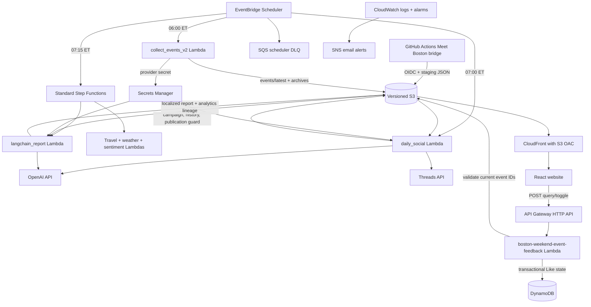

# AWS interview learning guide

This guide is the from-zero walkthrough for the Boston Weekend Agent. It is
written for two goals:

1. rebuild, deploy, and operate the project without relying on remembered
   console clicks;
2. explain the architecture clearly in a short technical interview.

The examples use AWS account `503561418425`, Region `us-east-1`, and CLI profile
`boston-deployer`. Never paste API keys, access tokens, or secret values into a
command that will be committed to Git.

## The 90-second explanation

Boston Weekend Agent is an event-driven, serverless content system. A scheduled
collector Lambda normalizes Greater Boston events into versioned S3 snapshots.
A daily social Lambda reads that snapshot, asks Bo's LLM ranking and writing
layers for bilingual copy, stores an audit record in S3, and publishes to
Threads with an idempotency guard. A separate Standard Step Functions workflow
orchestrates weather, travel context, sentiment, and the report Lambda; its
output is delivered to the website through CloudFront. The website's anonymous
Like feature uses API Gateway, a small validation Lambda, and DynamoDB
transactions. EventBridge Scheduler supplies the clocks, CloudWatch supplies
logs and alarms, SQS is the scheduler delivery DLQ, SNS delivers alerts, and
Secrets Manager keeps provider credentials out of code.

There is no EC2, Airflow, or Glue requirement. The workload runs a few bounded
jobs per day rather than continuously processing large distributed datasets, so
Lambda plus Step Functions is simpler and cheaper. Glue would become relevant
for large S3 data-lake ETL; Airflow would become relevant for many complex,
cross-system DAGs requiring a dedicated orchestration platform.

## End-to-end architecture



### Daily timeline

| Time in `America/New_York` | Target | Purpose |
| --- | --- | --- |
| 06:00 | `collect_events_v2` | Collect and normalize the next ten days of events. |
| 07:00 | `daily_social` | Rank near-term events, generate copy, archive it, and publish Threads. |
| 07:15 | `BostonWeekendAgentWorkflow` | Reuse the 06:00 snapshot and generate the rolling website report. |

The report schedule sends `{"skip_event_collection":true}` because event
collection already ran at 06:00. A manual state-machine execution without that
flag follows the default branch and invokes the collector again.

The report schedule still has the historical resource name
`boston-weekend-thursday-friday-report`, but its current expression is
`cron(15 7 * * ? *)`, so it runs every day at 07:15 Eastern. Thursday and Friday
select richer editorial modes inside the report code; they are no longer the
only scheduled report days.

## What each AWS service does

| Service | Role in this project | Important distinction |
| --- | --- | --- |
| IAM | Gives humans and workloads narrowly scoped permissions. | The deployer identity, Lambda execution roles, Scheduler role, and Step Functions role are different principals. |
| ECR | Stores immutable Linux container images. | ECR stores code; it does not execute it. |
| Lambda | Executes collector, report, social, and feedback code on demand. | Pushing an image does not update Lambda. Lambda must be pointed to the new image. |
| S3 | Stores event snapshots, reports, social history, publication guards, memory, and analytics lineage. | Stable `latest` keys serve production while timestamped keys preserve history. |
| Secrets Manager | Stores Ticketmaster, OpenAI, and Threads credentials. | Lambda environment variables contain secret ARNs, not plaintext secrets. |
| Step Functions | Orchestrates the multi-step report workflow and shows execution history. | It coordinates tasks; it is not the daily clock. |
| EventBridge Scheduler | Starts the three daily jobs in an explicit Eastern time zone. | It is separate from legacy EventBridge Rules. |
| CloudWatch | Receives Lambda/Step Functions logs, metrics, and alarms. | A Scheduler delivery success can still lead to a Lambda processing failure. |
| SQS | Stores exhausted Scheduler delivery attempts in a DLQ. | Lambda code exceptions do not automatically appear in this delivery DLQ. |
| SNS | Emails CloudWatch alarm notifications. | The email subscription must be confirmed. |
| CloudFront | Publishes only approved report objects from a private S3 bucket. | OAC lets the bucket remain private. |
| API Gateway | Exposes the feedback Lambda as an HTTP API with routes, CORS, and throttling. | It does not write DynamoDB directly in this design. |
| DynamoDB | Stores Like totals, per-browser vote state, and immutable action records. | A transaction updates all three atomically. |

## Current production inventory

### Container Lambdas

| Service directory | ECR repository | Lambda | Memory | Timeout |
| --- | --- | --- | ---: | ---: |
| `services/collect-events` | `boston-weekend-events` | `collect_events_v2` | 512 MB | 300 s |
| `services/langchain-report` | `boston-weekend-langchain` | `langchain_report` | 1024 MB | 300 s |
| `services/daily-social` | `boston-weekend-daily-social` | `daily_social` | 1024 MB | 300 s |
| `services/event-feedback` | `boston-weekend-event-feedback` | `boston-weekend-event-feedback` | 256 MB | 15 s |

All four ECR repositories use immutable tags and scan on push. All four Lambda
images are built for `linux/amd64`, matching the functions' `x86_64`
architecture.

The older `collect_events` ZIP Lambda still exists, but the active daily
schedule and state machine use `collect_events_v2`.

### Managed stacks

| Stack | Template | Owns |
| --- | --- | --- |
| `boston-weekend-schedules` | `infrastructure/cloudformation/schedules.yaml` | Scheduler role, three schedules, SQS DLQ, SNS topic/subscription, CloudWatch alarms. |
| `boston-weekend-event-feedback` | `infrastructure/cloudformation/event-feedback.yaml` | DynamoDB table, feedback role/Lambda, HTTP API, routes, integration, stage, and invoke permission. |

The core collector, report, and social Lambdas predate a unified application
stack. Their policies are checked in under `infrastructure/iam`, but their
resources are updated independently. A future improvement is to move all core
resources into one SAM, CDK, or CloudFormation application stack.

## Data contracts and storage

The S3 bucket is `boston-weekend-agent-reports` with Versioning enabled.

| Prefix/key | Meaning |
| --- | --- |
| `events/latest.json` | Current normalized event snapshot read by social and report jobs. |
| `events/archive/...` | Immutable collection history. |
| `events/changes/latest.json` | New, updated, and unconfirmed-missing event comparison. |
| `ingestion/meet-boston/latest.json` | GitHub Actions staging snapshot for Meet Boston. |
| `weather/latest.json` and `weather/summary.json` | Weather pipeline outputs. |
| `reports/weekend_summary.json` | Localized report plus Activities data used by the website and feedback validation. |
| `reports/weekend_summary.txt` | Text report compatibility output. |
| `reports/archive/...` | Historical report editions. |
| `analytics/report_runs/...` | Exact versioned inputs, outputs, model metadata, and lineage manifests. |
| `agent/bobo-memory.json` | Reviewed mutable preference memory. |
| `social/latest.json` and `.txt` | Latest social campaign. |
| `social/campaigns/...` | Immutable social campaign archives. |
| `social/history.json` | 48-hour event cooldown history. |
| `social/publications/threads/YYYY-MM-DD.json` | Per-day idempotency and publication state. |

### Secrets

| Secret name | JSON fields | Consumer |
| --- | --- | --- |
| `boston-weekend-agent/events-api` | `TICKETMASTER_API_KEY` | Collector Lambda |
| `boston-weekend-agent/openai` | `OPENAI_API_KEY` | Report and daily-social Lambdas |
| `boston-weekend-agent/threads` | `THREADS_ACCESS_TOKEN`, `THREADS_USER_ID`, `THREADS_USERNAME` | Daily-social Lambda |

## Start a new local session

### 1. Clone and enter the repository

```bash
git clone https://github.com/annaandmandy/boston-weekend-agent.git
cd boston-weekend-agent
git status
```

### 2. Authenticate without a long-lived local access key

This project uses AWS CLI browser login for the named deployer profile:

```bash
/opt/homebrew/bin/aws login \
  --profile boston-deployer \
  --region us-east-1

/opt/homebrew/bin/aws sts get-caller-identity \
  --profile boston-deployer \
  --region us-east-1
```

The expected ARN ends in `user/boston-weekend-deployer`. Re-run `aws login`
when the session expires. The deployer is for human deployments; do not reuse it
as a Lambda execution role.

### 3. Create the Python environment and test

```bash
python3.11 -m venv .venv
.venv/bin/pip install \
  -r services/collect-events/requirements.txt \
  -r services/langchain-report/requirements.txt \
  -r services/daily-social/requirements.txt \
  boto3

.venv/bin/python -m unittest discover -s tests -v
```

Tests use mocks and must not call production APIs or publish Threads posts.

### 4. Use a reviewable GitHub workflow

Make changes on a branch rather than directly on `main`:

```bash
git switch -c docs/<SHORT_TOPIC>
git status
git diff --check
git add <FILES_YOU_REVIEWED>
git commit -m "Document <SHORT_TOPIC>"
git push -u origin docs/<SHORT_TOPIC>
gh pr create --fill
gh pr checks --watch
gh pr merge --squash --delete-branch
git switch main
git pull --ff-only
```

Before staging, inspect `git diff` and confirm that no secret, local response
file, or unrelated user change is included. GitHub stores and reviews source;
it does not deploy a new Lambda image unless a separate workflow explicitly
does the Docker/ECR/Lambda steps below.

## Understand the container deployment lifecycle

The lifecycle is always:

```text
source + requirements + Dockerfile
              |
              v
        docker buildx
              |
              v
       ECR image:tag
              |
              v
 aws lambda update-function-code
              |
              v
 Lambda resolves and pins the image digest
```

This last step matters: Lambda resolves an ECR tag to a digest. Pushing a new
image under a tag does not make an existing Lambda use it automatically. Always
run `update-function-code` after the push.

### One-time ECR repository creation

Run once per service, changing the repository name:

```bash
/opt/homebrew/bin/aws ecr create-repository \
  --repository-name boston-weekend-daily-social \
  --image-tag-mutability IMMUTABLE \
  --image-scanning-configuration scanOnPush=true \
  --profile boston-deployer \
  --region us-east-1
```

Console equivalent:

1. Open **Elastic Container Registry > Private registry > Repositories**.
2. Choose **Create repository**.
3. Use a private repository, immutable tags, and scan on push.
4. Copy the repository URI.

### Authenticate Docker to ECR

The ECR authorization token expires, so repeat this when a push says the token
has expired:

```bash
/opt/homebrew/bin/aws ecr get-login-password \
  --profile boston-deployer \
  --region us-east-1 \
| docker login \
  --username AWS \
  --password-stdin 503561418425.dkr.ecr.us-east-1.amazonaws.com
```

### Build and push one service

Use a unique immutable tag such as `<purpose>-<short-git-sha>`. Example for
daily social:

```bash
docker buildx build \
  --platform linux/amd64 \
  --provenance=false \
  -f services/daily-social/Dockerfile \
  -t 503561418425.dkr.ecr.us-east-1.amazonaws.com/boston-weekend-daily-social:<TAG> \
  --push \
  services/daily-social
```

Why each flag exists:

- `--platform linux/amd64`: match the Lambda architecture;
- `--provenance=false`: keep the pushed manifest compatible and simple for
  Lambda;
- `-f`: select the service Dockerfile;
- final directory: the Docker build context, so `COPY requirements.txt` finds
  the file inside that service;
- `--push`: send the built image to ECR instead of keeping it only locally.

### Point Lambda to the new image

```bash
/opt/homebrew/bin/aws lambda update-function-code \
  --function-name daily_social \
  --image-uri 503561418425.dkr.ecr.us-east-1.amazonaws.com/boston-weekend-daily-social:<TAG> \
  --profile boston-deployer \
  --region us-east-1

/opt/homebrew/bin/aws lambda wait function-updated \
  --function-name daily_social \
  --profile boston-deployer \
  --region us-east-1

/opt/homebrew/bin/aws lambda get-function \
  --function-name daily_social \
  --profile boston-deployer \
  --region us-east-1 \
  --query '{State:Configuration.State,Update:Configuration.LastUpdateStatus,Image:Code.ImageUri,Digest:Code.ResolvedImageUri}'
```

Console equivalent:

1. Open **Lambda > Functions > daily_social**.
2. In the image/code section choose **Deploy new image**.
3. Browse ECR, select the repository and exact immutable tag, then save.
4. Open **Configuration > General configuration** to verify memory and timeout.
5. Open **Monitor > View CloudWatch logs** after a test invocation.

Repeat the same pattern using this mapping:

| Build context | Repository | Function |
| --- | --- | --- |
| `services/collect-events` | `boston-weekend-events` | `collect_events_v2` |
| `services/langchain-report` | `boston-weekend-langchain` | `langchain_report` |
| `services/daily-social` | `boston-weekend-daily-social` | `daily_social` |
| `services/event-feedback` | `boston-weekend-event-feedback` | `boston-weekend-event-feedback` |

### Safe direct invocation

Collector:

```bash
/opt/homebrew/bin/aws lambda invoke \
  --function-name collect_events_v2 \
  --payload '{"trigger":"manual-test"}' \
  --cli-binary-format raw-in-base64-out \
  --cli-read-timeout 360 \
  --profile boston-deployer \
  --region us-east-1 \
  /tmp/collect-events-response.json
```

Daily social requires more care. A production invocation can publish to Threads
when `THREADS_PUBLISH_ENABLED=true`. First inspect the current local-date guard:

```bash
/opt/homebrew/bin/aws s3api head-object \
  --bucket boston-weekend-agent-reports \
  --key social/publications/threads/YYYY-MM-DD.json \
  --profile boston-deployer \
  --region us-east-1
```

Do not delete a `publishing`, `failed`, or partially populated guard until the
Threads account and CloudWatch logs prove what was published.

### Rollback

Because tags are immutable, rollback means pointing Lambda back to a known-good
image tag:

```bash
/opt/homebrew/bin/aws lambda update-function-code \
  --function-name daily_social \
  --image-uri 503561418425.dkr.ecr.us-east-1.amazonaws.com/boston-weekend-daily-social:<KNOWN_GOOD_TAG> \
  --profile boston-deployer \
  --region us-east-1
```

## First-time Lambda setup

For a new image Lambda, create its execution role first. The trust relationship
must allow `lambda.amazonaws.com` to call `sts:AssumeRole`. Attach
`AWSLambdaBasicExecutionRole` for CloudWatch Logs, then add only the scoped
permissions from `infrastructure/iam/*.json`.

Console flow:

1. **IAM > Roles > Create role > AWS service > Lambda**.
2. Attach `AWSLambdaBasicExecutionRole`.
3. Create the role, then add the repo's scoped inline policy after replacing
   secret ARN placeholders.
4. **Lambda > Create function > Container image**.
5. Choose the ECR image, `x86_64`, memory, timeout, and the execution role.
6. Add non-secret environment variables under **Configuration > Environment
   variables**.

CLI shape:

```bash
/opt/homebrew/bin/aws lambda create-function \
  --function-name <FUNCTION_NAME> \
  --package-type Image \
  --code ImageUri=<FULL_ECR_IMAGE_URI> \
  --role <LAMBDA_EXECUTION_ROLE_ARN> \
  --architectures x86_64 \
  --memory-size <MB> \
  --timeout <SECONDS> \
  --profile boston-deployer \
  --region us-east-1
```

Use `update-function-configuration` for environment variables, but prefer the
console or a reviewed JSON file over a long shell command. Never put plaintext
provider keys into Lambda configuration.

## Secrets Manager setup

Console flow:

1. Open **Secrets Manager > Store a new secret**.
2. Choose **Other type of secret**.
3. Enter the JSON key/value fields listed in the Secrets table above.
4. Use the exact project secret name.
5. Copy the full secret ARN into the Lambda environment variable and IAM policy.

Relevant Lambda environment variables:

- collector: `EVENTS_SECRET_ID`;
- report/social: `OPENAI_SECRET_ID`;
- social: `THREADS_SECRET_ID`.

The daily-social role needs both `GetSecretValue` and `PutSecretValue` on the
Threads secret because it refreshes the long-lived token before expiration.

## Step Functions setup and use

The checked-in definition is
`infrastructure/step-functions/workflow.asl.json`. It contains placeholders so
the same definition can be reviewed without hard-coding every account ARN.

Current task order:

```text
Choice: skip collection?
  no  -> collect_events_v2
  yes -> reuse events/latest.json
        |
        v
collect_travel_data -> collect_weather -> upload_to_s3
-> weather_summary -> upload_summary_to_s3 -> sentiment_analysis
-> langchain_report
```

Console flow:

1. Open **Step Functions > State machines > BostonWeekendAgentWorkflow**.
2. Choose **Edit** and inspect the definition in Code mode or Workflow Studio.
3. Resolve every `${...FunctionArn}` placeholder to the intended Lambda ARN.
4. Ensure the execution role can invoke every Lambda in the definition.
5. Configure ERROR logging to
   `/aws/vendedlogs/states/BostonWeekendAgentWorkflow`, include execution data,
   and retain logs for 30 days.
6. Save, then **Start execution** with a named test input.

CLI update after creating a resolved temporary definition:

```bash
/opt/homebrew/bin/aws stepfunctions update-state-machine \
  --state-machine-arn arn:aws:states:us-east-1:503561418425:stateMachine:BostonWeekendAgentWorkflow \
  --definition file:///tmp/workflow-resolved.asl.json \
  --profile boston-deployer \
  --region us-east-1
```

Do not pass the placeholder file directly to production.

Start a manual report that reuses the current event snapshot:

```bash
/opt/homebrew/bin/aws stepfunctions start-execution \
  --state-machine-arn arn:aws:states:us-east-1:503561418425:stateMachine:BostonWeekendAgentWorkflow \
  --input '{"trigger":"manual-report","skip_event_collection":true}' \
  --profile boston-deployer \
  --region us-east-1
```

## EventBridge Scheduler setup and use

Prefer the checked-in CloudFormation template because it creates the schedules,
execution role, retry policy, DLQ, alarms, and SNS topic together:

```bash
/opt/homebrew/bin/aws cloudformation deploy \
  --template-file infrastructure/cloudformation/schedules.yaml \
  --stack-name boston-weekend-schedules \
  --capabilities CAPABILITY_NAMED_IAM \
  --parameter-overrides \
    CollectorFunctionArn=arn:aws:lambda:us-east-1:503561418425:function:collect_events_v2 \
    DailySocialFunctionArn=arn:aws:lambda:us-east-1:503561418425:function:daily_social \
    WeekendStateMachineArn=arn:aws:states:us-east-1:503561418425:stateMachine:BostonWeekendAgentWorkflow \
    AlertEmail=<YOUR_EMAIL> \
  --profile boston-deployer \
  --region us-east-1
```

Console flow for understanding or creating one schedule manually:

1. Open **Amazon EventBridge > Scheduler > Schedules > Create schedule**.
2. Enter the schedule name and recurring cron expression.
3. Set **Flexible time window** to Off.
4. Set the time zone to `America/New_York`; otherwise daylight-saving changes
   can shift the local run time.
5. Select the target Lambda or Step Functions state machine and enter its JSON
   payload.
6. Select or create an execution role that permits `lambda:InvokeFunction` or
   `states:StartExecution` for that exact target.
7. Configure retry age/attempts and the SQS DLQ.
8. Enable the schedule.

Inspect production:

```bash
/opt/homebrew/bin/aws scheduler get-schedule \
  --name boston-weekend-daily-social \
  --profile boston-deployer \
  --region us-east-1
```

## DynamoDB and API Gateway feedback system

This subsystem is independent of event collection and LLM generation:

```text
Activities tab
  -> POST /feedback/query or /feedback/toggle
  -> API Gateway HTTP API
  -> feedback Lambda
  -> validate event_id against current S3 report
  -> DynamoDB transaction
```

### DynamoDB data model

Table: `boston-weekend-event-feedback`

- partition key: `pk` (String);
- sort key: `sk` (String);
- billing: on-demand (`PAY_PER_REQUEST`);
- encryption: enabled;
- point-in-time recovery: enabled;
- no secondary index is currently required.

All records for one event share `pk = EVENT#<event_id>`:

| Sort key | Entity | Purpose |
| --- | --- | --- |
| `SUMMARY` | Aggregate | Current Like count and event dimensions. |
| `VOTER#<sha256 visitor id>` | Vote state | Makes one browser's Like reversible without storing its raw ID. |
| `ACTION#<timestamp>#<request id>` | Audit event | Immutable like/unlike analytics history. |

`TransactWriteItems` changes voter state, count, and action history atomically.
Conditional expressions make repeated requests idempotent and prevent a count
from going below zero.

### API Gateway configuration

Production HTTP API:

- name: `boston-weekend-event-feedback`;
- routes: `POST /feedback/query`, `POST /feedback/toggle`;
- integration: Lambda `AWS_PROXY`, payload format 2.0;
- stage: `$default`, auto-deploy enabled;
- throttle: 10 requests/second, burst 20;
- CORS: production website plus local Vite origins;
- authentication: anonymous by design; validation happens in Lambda.

The Lambda accepts only well-formed IDs, hashes the browser visitor ID, and
checks that a toggled event exists in the current report. This prevents clients
from writing arbitrary event IDs into DynamoDB.

### Deploy the feedback stack

First build and push a new feedback image using the standard ECR lifecycle,
then deploy the CloudFormation template:

```bash
/opt/homebrew/bin/aws cloudformation deploy \
  --template-file infrastructure/cloudformation/event-feedback.yaml \
  --stack-name boston-weekend-event-feedback \
  --capabilities CAPABILITY_NAMED_IAM \
  --parameter-overrides \
    FeedbackImageUri=503561418425.dkr.ecr.us-east-1.amazonaws.com/boston-weekend-event-feedback:<TAG> \
  --profile boston-deployer \
  --region us-east-1

/opt/homebrew/bin/aws cloudformation describe-stacks \
  --stack-name boston-weekend-event-feedback \
  --profile boston-deployer \
  --region us-east-1 \
  --query 'Stacks[0].Outputs'
```

Set the returned `FeedbackApiUrl` as the website's
`VITE_FEEDBACK_API_URL`. The current frontend reads that variable in
`BostonWeekendAgent.jsx` and falls back to the production endpoint.

Console flow if learning the individual resources:

1. **DynamoDB > Tables > Create table**: enter the table name, `pk` partition
   key, `sk` sort key, on-demand capacity, and encryption. After creation, open
   **Backups** and enable point-in-time recovery (PITR).
2. **Lambda > Create function > Container image**: create the feedback Lambda
   with its DynamoDB and exact S3 object permissions.
3. **API Gateway > Create API > HTTP API**: add the Lambda integration.
4. Add the two POST routes and attach both to the same integration.
5. Create the `$default` auto-deploy stage and set throttling.
6. Configure CORS origins/method/header.
7. Ensure API Gateway has a resource-based Lambda invoke permission.

For production, deploy the CloudFormation template instead of recreating these
clicks; manual setup is for understanding the parts.

## Website delivery

The report S3 bucket remains private. CloudFront distribution `EBSSO01S4DVXI`
uses S3 Origin Access Control and serves the current report at:

```text
https://d2ugiuoady5eh5.cloudfront.net/reports/weekend_summary.json
```

The website refreshes this JSON, defaults to English, provides a Traditional
Chinese tab, and renders the Activities table. Feedback requests go to API
Gateway, not CloudFront.

## Operations and troubleshooting

### CloudWatch Lambda logs

```bash
/opt/homebrew/bin/aws logs tail /aws/lambda/daily_social \
  --since 24h \
  --format short \
  --profile boston-deployer \
  --region us-east-1
```

Change the log group name for other functions.

### Scheduler DLQ

```bash
/opt/homebrew/bin/aws sqs get-queue-attributes \
  --queue-url https://sqs.us-east-1.amazonaws.com/503561418425/boston-weekend-scheduler-dlq \
  --attribute-names ApproximateNumberOfMessages ApproximateNumberOfMessagesNotVisible \
  --profile boston-deployer \
  --region us-east-1
```

Remember the boundary:

- Scheduler cannot deliver target -> retry -> SQS DLQ;
- Lambda starts but code raises -> Lambda error metric/log/alarm;
- Step Functions task fails -> execution history and state-machine alarm.

### S3 freshness

```bash
/opt/homebrew/bin/aws s3api head-object \
  --bucket boston-weekend-agent-reports \
  --key events/latest.json \
  --profile boston-deployer \
  --region us-east-1

/opt/homebrew/bin/aws s3api head-object \
  --bucket boston-weekend-agent-reports \
  --key reports/weekend_summary.json \
  --profile boston-deployer \
  --region us-east-1
```

### Feedback API smoke test

Use event IDs from the current public report, not invented IDs:

```bash
curl -X POST \
  https://nw4rup2tcj.execute-api.us-east-1.amazonaws.com/feedback/query \
  -H 'Content-Type: application/json' \
  -d '{"event_ids":["<CURRENT_EVENT_ID>"],"visitor_id":"interview_test_1234567890"}'
```

### Inspect DynamoDB without scanning the whole table

```bash
/opt/homebrew/bin/aws dynamodb query \
  --table-name boston-weekend-event-feedback \
  --key-condition-expression 'pk = :pk' \
  --expression-attribute-values '{":pk":{"S":"EVENT#<EVENT_ID>"}}' \
  --profile boston-deployer \
  --region us-east-1
```

## Interview questions to rehearse

### Why containers for Lambda?

They make Python dependencies reproducible, keep persona/memory bootstrap files
next to the code, and avoid rebuilding ad-hoc Lambda layers. The tradeoff is an
extra ECR lifecycle and larger cold-start artifacts than a small ZIP.

### Why Step Functions and Scheduler?

Scheduler answers *when* a workflow starts. Step Functions answers *which steps
run, in what order, with what retry/history*. Keeping those concerns separate
makes failures easier to observe.

### Why S3 and DynamoDB?

S3 is ideal for immutable snapshots, reports, and lineage files. DynamoDB is
ideal for low-latency keyed state and atomic Like transactions. A database is
not needed for every event snapshot, and an object store is not appropriate for
concurrent counters.

### How is duplicate Threads publication prevented?

The social Lambda claims a date-specific S3 publication object before posting,
records progress after every post, and refuses a blind retry after partial
publication. Long copy is split inside each language at the platform limit.

### How are credentials protected?

Secrets live in Secrets Manager. Each Lambda receives only the secret ARN and a
least-privilege execution-role statement. The public repository contains no
provider key or Threads token.

### How does the system fail safely?

Source failures are isolated; unavailable events are deterministically filtered;
snapshots are versioned; alarms distinguish delivery, function, and workflow
failure; publication is idempotent; and model decisions are archived with model,
prompt, memory version, token use, reasons, and ranking.

### What would you improve next?

Move the remaining manually managed core Lambdas, Step Functions, CloudFront,
S3, and secrets metadata into one reviewed IaC application; add automated smoke
tests after deployment; add API authentication or abuse controls if feedback
traffic grows; and build dashboards/evaluations from archived rankings and Likes.

## Suggested order for a weekend study session

1. Draw the architecture from memory and explain Scheduler versus Step
   Functions.
2. Run unit tests and read one Lambda handler per service.
3. Build one image locally, then explain Docker context, architecture, and tag.
4. Inspect ECR and the corresponding Lambda image digest.
5. Follow one event from collector output through S3, report, CloudFront, and the
   website.
6. Follow one Like from browser request through API Gateway, Lambda, and the
   three DynamoDB entity types.
7. Inspect one successful and one failed CloudWatch execution.
8. Practice the interview questions above without reading the answers.

## Official AWS references

- [Deploy Python Lambda functions with container images](https://docs.aws.amazon.com/lambda/latest/dg/python-image.html)
- [Amazon ECR image lifecycle with the CLI](https://docs.aws.amazon.com/AmazonECR/latest/userguide/getting-started-cli.html)
- [ECR `get-login-password`](https://docs.aws.amazon.com/cli/latest/reference/ecr/get-login-password.html)
- [Invoke Lambda with EventBridge Scheduler](https://docs.aws.amazon.com/lambda/latest/dg/with-eventbridge-scheduler.html)
- [EventBridge Scheduler schedule types and time zones](https://docs.aws.amazon.com/scheduler/latest/UserGuide/schedule-types.html)
- [API Gateway HTTP API with Lambda and DynamoDB](https://docs.aws.amazon.com/apigateway/latest/developerguide/http-api-dynamo-db.html)
- [CloudFormation API Gateway v2 integration reference](https://docs.aws.amazon.com/AWSCloudFormation/latest/TemplateReference/aws-resource-apigatewayv2-integration.html)
